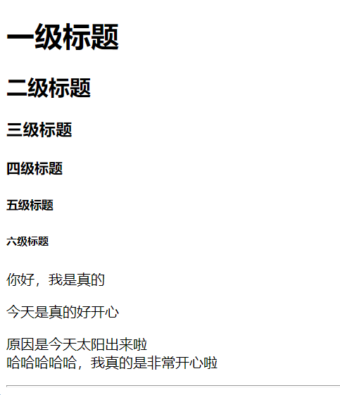

[TOC]


# 1.一些记录

## 1.1一些概念

- HTML是超文本标记语言，它是有一套标记语法的
- 浏览器有很多种版本，每个版本对HTML的语法支持的也不一样
- 可以在[caniuse.com](https://caniuse.com/)查询标签是否在某个浏览器种能使用

## 1.2Web网页组成部分


可以做一个类比：


需要注意的事项：

- 文件名尽量用小写
- 文件名中最好不要有空格，一些服务器将会把文件名里的空格替换为 “%20”（URI 里空格的编码），从而使链接遭到破坏。
- 最好使用中划线，而不是下划线来分离单词
- 简言之，文件名中应使用连字符。谷歌搜索引擎把连字符当作单词的分隔符， 但不会识别下划线。

## 1.3认识标签

- `html`
- `head`
- `body`
- `br`
- `center`

## 1.4HTML模板

HTML的基本语法：

1. 常规标记，也叫双标记，双元素有头有尾，例如<html></html>
2. 空标记，也叫单标记，例<br/>

语言模板设置

```
<!-- <html lang="en"> -->
    <!-- 页面会做出提示 -->
    <html lang="ja-jp">
```

> - "en"代表英文
> - "zh-CN"代表中文
> - "ja-jp"代表日文

会有弹出框


认识meta

```html
<meta charset="UTF-8">
    <meta http-equiv="X-UA-Compatible" content="IE=edge">
    <meta name="viewport" content="width=device-width, initial-scale=1.0">
```

> - ASCII是美国信息交换标准代码
> - ISO-8859-1是拉丁字母表的字符编码
> - GB2312是汉字编码字符集
> - UTF-8-Unicode万国码字符编码

## 1.5标签的语义


> 语义化会让页面更加好看，方便使用者抓住重点，更易观赏

网页结构清晰，也就是语义化的好处：

- 裸奔好看
- 爬虫方便(**SEO**)
- 方便维护

1.文本标题

`<h1>一级标题</h1>`

`<h2>二级标题</h2>`

`<h3>三级标题</h3>`

`<h4>四级标题</h4>`

`<h5>五级标题</h5>`

`<h6>六级标题</h6>`


> **文本标题标签自带加粗，有自己的文本大小，并且独占一行，有默认间距**

2.段落标签

1. `<p></p>`
2. `<br/>`
3. `<hr/>`分割线



4. `<b></b>` 或者 `<strong></strong>`
5. `<em></em>`或者`<i></i>`斜体
6. `<s></s>`或者`<del></del>`删除线
7. `<u></u>`下划线
8. `<sub></sub>`下标
9. `<sup></sup>`上标

## 1.6不一样的hr属性

```html
<hr color="green">
<hr color="red">
<hr color="yellow">
<p>width为长度</p>
<hr color="blue" width="300">
<hr color="blue" width="600">
<p>align为对齐方式</p>
<hr color="green" width="600" align="left">
<hr color="green" width="600" align="right">
<hr color="green" width="600" align="center">
<p>分割线默认看起来是灰色的，其实是有阴影，下面就取消阴影</p>
<hr>
<hr noshade>
```

## 1.7特殊符号


==补充的转义字符：==

| **原义字符**     | **等价字符引用** |
| ---------------- | ---------------- |
| "                | \&quot;          |
| '                | \&apos;          |
| <                | \&lt;            |
| >                | \&gt;            |
| 空格1            | \&nbsp;          |
| 空格2            | \&emsp;          |
| 版权&copy;       | \&copy;          |
| 商标&trade;&reg; | \&trade;&reg;    |

## 1.8额外补充的元素标签

- `<ul></ul>`无序列表
  
  - `<li></li>`子列表
  
- `<ol></ol>`有序列表
  
  - `<li></li>`子列表
  
- `<a href=""></a>`超链接

  - ```html
    <!--a标签的属性介绍-->
    <a href="https://zh.wikipedia.org/zh-hans/葵花宝典" title="葵花宝典简介" target="_blank">葵花宝典</a>
    ```

    具体介绍见：[为一个元素添加属性](https://developer.mozilla.org/zh-CN/docs/learn/HTML/Introduction_to_HTML/Getting_started#%E5%AD%A6%E4%B9%A0%E5%AE%9E%E8%B7%B5%EF%BC%9A%E4%B8%BA%E4%B8%80%E4%B8%AA%E5%85%83%E7%B4%A0%E6%B7%BB%E5%8A%A0%E5%B1%9E%E6%80%A7)

- ``图片链接

