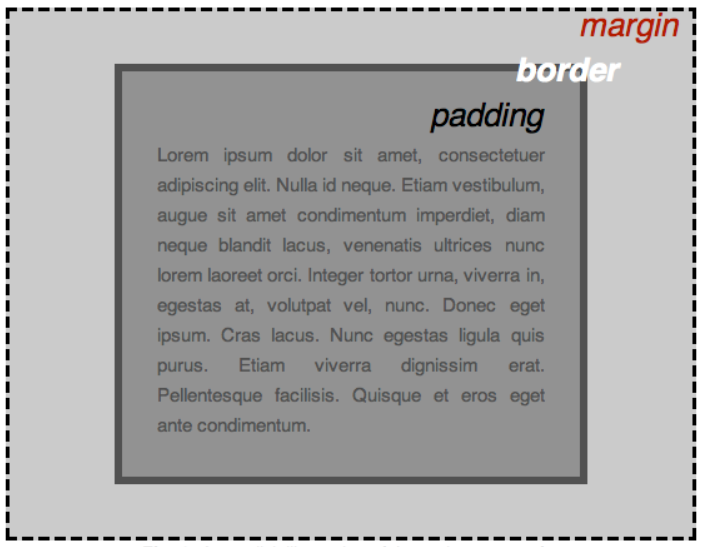

# 1.初步了解CSS和JavaScript

[看到这里了](https://developer.mozilla.org/zh-CN/docs/Learn/Getting_started_with_the_web/CSS_basics)

## 1.1css文件的引入

使用链接：

```html
<link rel="stylesheet" href="style/style.css" />
```

css文件的编写

```css
p{
    color: red;
} 
```

[css文件具体编辑细节：](https://developer.mozilla.org/zh-CN/docs/Learn/Getting_started_with_the_web/CSS_basics)

## 1.2盒子模型

CSS的布局主要基于盒模型，每个占据页面空间的块都有这样的属性：

- padding：内边距，围绕着内容（比如段落）的空间。
- border：边框，紧接着内边距的线。
- margin：外边距，围绕元素外部的空间。



此外，还有一些参数需要记住：

- `width` ：元素的宽度
- `background-color` ：元素内容和内边距底下的颜色
- `color` ：元素内容（通常是文本）的颜色
- `text-shadow` ：为元素内的文本设置阴影
- `display` ：设置元素的显示模式（暂略）

一切元素遵循盒子模型，没有设置的都是透明的

## 1.3JavaScript

在JavaScript里，一切都为对象

JavaScript的注释有两种，不像CSS和HTML注释只有一种

```js
/*
这里的所有内容
都是注释。
*/
```

```js
// 这是一条注释。
```

JavaScript文件的引用：

```html
<script src="./script.js"></script>
```

