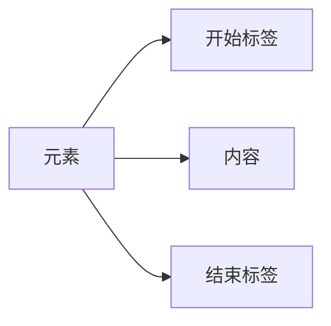
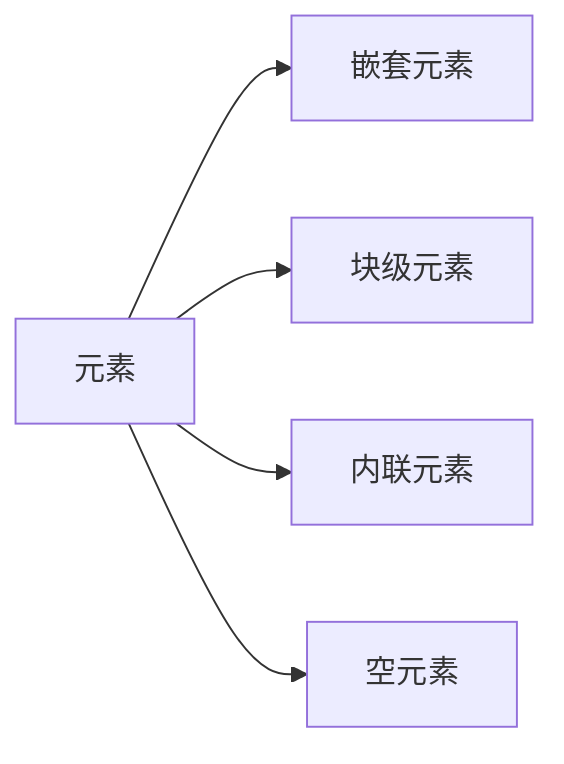
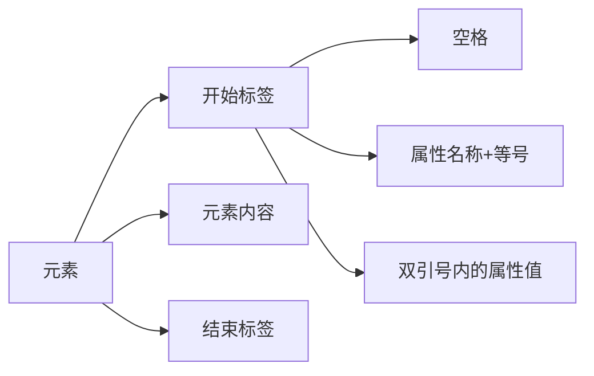
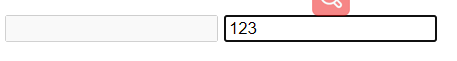
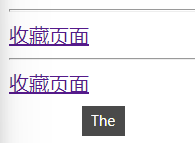
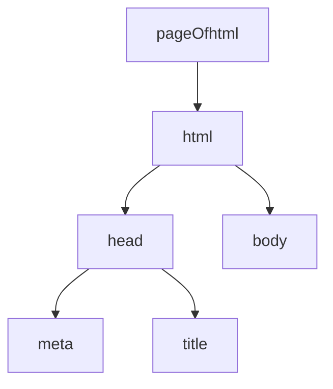
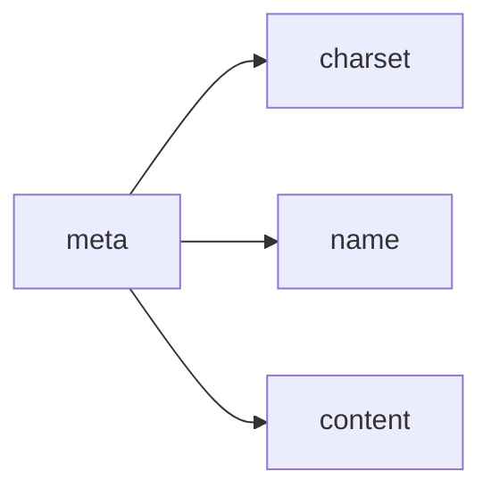

---
从今天开始，正式开始HTML的学习
---

# HTML

## 1定义

HTML是由一系列元素组成，这些元素可以用来包围不同部分的内容，使其以某种方式呈现或者工作。 一对标签（ [tags](https://developer.mozilla.org/zh-CN/docs/Glossary/Tag)）可以为一段文字或者一张图片添加超链接，将文字设置为斜体，改变字号，等等。 

**需要注意的是，HTML标签不区分大小写，但是从一致性、可读性来说，最好使用小写！小写！小写！**

### 1.1标签速查

HTML常用标签见下面的：

[HTML常用标签]: C:\Users\litelte\Documents\Code\FrontLeaningRecord\day1\Readme.md	"HTML常用标签"

## 2元素标签组成及分类

总结来说，元素的组成分为：

- 开始标签
- 内容
- 结束标签



下面了解元素的分类：



> - 其实简单来说，嵌套元素即元素内可以添加其他元素；
> - 而块元素，就是每个元素会重开一行，比如说段落，分割线
> - 内敛元素，元素和元素之间会挤在一起，不会重开一行
> - 空元素只有一个开始标签，没有结束标签，比如图片img

## 3元素的属性


一个属性必须包含如下内容：

1. 一个空格，在属性和元素名称之间。(如果已经有一个或多个属性，就与前一个属性之间有一个空格。)
2. 属性名称，后面跟着一个等于号。
3. 一个属性值，由一对引号“ ”引起来。

这样一个元素的构成即可全部呈现：



再来看一次，就是这样：


当然还有其他的属性：

- 布尔属性

  - ```html
    <!--有时你会看到没有值的属性，它是合法的。这些属性被称为布尔属性，他们只能有跟它的属性名一样的属性值。例如disabled 属性，他们可以标记表单输入使之变为不可用(变灰色)，此时用户不能向他们输入任何数据。-->
    <input type="text" disabled="disabled">
    ```

  - ```html
    <!-- 使用布尔属性 用户不可输入-->
    <input type="text" disabled>
    <!-- 使用布尔属性，用户可输入 -->
    <input type="text">
    ```

    

==省略属性的双引号，容易破坏标记==，如下代码：

```html
<a href=https://www.mozilla.org/>收藏页面</a>
<hr>
<a href=https://www.mozilla.org/ title=The Mozilla homepage>收藏页面</a>
```

运行结果会显示链接的title为the



当然，对于单引号或者双引号，这都是没有区别的，必须统一，但不能混用

## 4HTML代码模板分析

```html
<!DOCTYPE html>
<html>
  <head>
    <meta charset="utf-8">
    <title>我的测试站点</title>
  </head>
  <body>
    <p>这是我的页面</p>
  </body>
</html>
```

然后下面是一些对HTML页面头的分析：

> 1. ```
>    <!DOCTYPE html>
>    ```
>
>    : 声明文档类型. 很久以前，早期的HTML(大约1991年2月)，文档类型声明类似于链接，规定了HTML页面必须遵从的良好规则，能自动检测错误和其他有用的东西。使用如下：
>
>    ```
>    <!DOCTYPE html PUBLIC "-//W3C//DTD XHTML 1.0 Transitional//EN"
>    "http://www.w3.org/TR/xhtml1/DTD/xhtml1-transitional.dtd">
>    ```
>
>    然而这种写法已经过时了，这些内容已成为历史。只需要知道 
>
>    ```
>    <!DOCTYPE html>
>    ```
>
>     
>
>    是最短有效的文档声明。
>
> 2. `<html></html>`: `<html>`元素。这个元素包裹了整个完整的页面，是一个根元素。
>
> 3. `<head></head>`: `<head>元素`. 这个元素是一个容器，它包含了所有你想包含在HTML页面中但不想在HTML页面中显示的内容。这些内容包括你想在搜索结果中出现的关键字和页面描述，CSS样式，字符集声明等等。以后的章节能学到更多关于<head>元素的内容。
>
> 4. `<meta charset="utf-8">`: 这个元素设置文档使用utf-8字符集编码，utf-8字符集包含了人类大部分的文字。基本上他能识别你放上去的所有文本内容。毫无疑问要使用它，并且它能在以后避免很多其他问题。
>
> 5. `<title></title>`: 设置页面标题，出现在浏览器标签上，当你标记/收藏页面时它可用来描述页面。
>
> 6. `<body></body>`: `<body>`元素。 包含了你访问页面时所有显示在页面上的内容，文本，图片，音频，游戏等等。

## 5HTML中的字符

可以见day1记录的：

[之前记录过的]: C:\Users\litelte\Documents\Code\FrontLeaningRecord\day1\Readme.md	"HTML转义符号"

## 6HTML头部元素组成

承接上面的代码模板，我们可以看到，一份HTML代码中包含的头部元素为：

- html
- head
- meta
- title
- body



- 显而易见，title就是网页的标题，在浏览器标签上显示的那种
- meta为元数据，包含的东西多了
  - `name` 指定了meta 元素的类型； 说明该元素包含了什么类型的信息。
  - `content` 指定了实际的元数据内容。



- meta元素可以有多个，作用有二：
  - 指定作者在某些情况下是很有用的：如果你需要联系页面的作者，问一些关于页面内容的问题。 一些内容管理系统能够自动获取页面作者的信息，然后用于某些用途。
  - 指定包含关于页面内容的关键字的页面内容的描述是很有用的，因为它可能或让你的页面在搜索引擎的相关的搜索出现得更多 （这些行为术语上被称为 [Search Engine Optimization](https://developer.mozilla.org/zh-CN/docs/Glossary/SEO), or [SEO](https://developer.mozilla.org/zh-CN/docs/Glossary/SEO).）

- 其他类型的元数据，比如某些公司特有的meta协议，facebook的

  - ```html
    <meta name="twitter:title" content="Mozilla Developer Network">
    ```

<hr>

当然，每个网页的标签页上，除了title，还有图标，这里就是<link>标签了，元素及格式如下：

```html
<link rel="shortcut icon" href="favicon.ico" type="image/x-icon">
```


## 7在HTML中使用CSS和JavaScript

- [link](https://developer.mozilla.org/zh-CN/docs/Web/HTML/Element/link) 元素经常位于文档的头部。这个link元素有2个属性，rel="stylesheet"表明这是文档的样式表，而 href包含了样式表文件的路径：

  ```html
  <link rel="stylesheet" href="my-css-file.css">
  ```

  <script> 部分没必要非要放在文档头部；实际上，把它放在文档的尾部（在 </body>标签之前）是一个更好的选择，这样可以确保在加载脚本之前浏览器已经解析了HTML内容（如果脚本加载某个不存在的元素，浏览器会报错）。

  ```html
  <script src="my-js-file.js"></script>
  ```

  **注意：** `<script>`元素看起来像一个空元素，但它并不是，因此需要一个结束标记。您还可以选择将脚本放入`<script>`元素中，而不是指向外部脚本文件。

## 8HTML文字处理

首先需要知道一个概念：==语义==

> HTML的主要工作是编辑文本结构和文本内容（也称为语义[semantics](https://developer.mozilla.org/zh-CN/docs/Glossary/Semantics)），以便浏览器能正确的显示。 本文介绍了 [HTML](https://developer.mozilla.org/zh-CN/docs/Glossary/HTML)的使用方法：在一段文本中添加标题和段落，强调语句，创建列表等等。

### 8.1标题和段落

使用<p>、<h1>、<h2>、<h3>、<h4>、<h5>、<h6>标签

### 8.2对语义的理解

[**==为什么我们需要语义？==**](https://developer.mozilla.org/zh-CN/docs/learn/HTML/Introduction_to_HTML/HTML_text_fundamentals#为什么我们需要语义？)

在我们身边的任何地方都要依赖语义学 — 我们依靠以前的经验就知道日常事物都代表什么；当我们看到什么，我们就会知道它代表什么。举个例子, 我们知道红色交通灯表示“停止”，绿色交通灯表示”通行“。 如果运用了错误的语义，事情会迅速地变得非常棘手 (难道有某个国家使用红色代表通行？我不希望如此)

同样的道理，我们需要确保使用了正确的元素来给予内容正确的意思、作用以及外形。在这里，[<h1>(en-US)](https://developer.mozilla.org/en-US/docs/Web/HTML/Element/Heading_Elements) 元素也是一个语义元素，它给出了包裹在您的页面上用来表示顶级标题的角色（或意义）的文本。

```html
<h1>这是一个顶级标题</h1>
```

一般来说，浏览器会给它一个更大的字形来让它看上去像个标题（虽然你可以使用CSS让它变成任何你想要的样式。更重要的是，它的语义值将以多种方式被使用，比如通过搜索引擎和屏幕阅读器（上文提到过的）。

在另一方面，你可以让任一元素看起来像一个顶级标题，如下：

```html
<span style="font-size: 32px; margin: 21px 0;">这是顶级标题吗？</span>
```

这是一个 [<span>](https://developer.mozilla.org/zh-CN/docs/Web/HTML/Element/span) 元素，它没有语义。当您想要对它用CSS（或者JS）时，您可以用它包裹内容，且不需要附加任何额外的意义（在未来的课程中你会发现更多这类元素）。我们已经对它使用了CSS来让它看起来像一个顶级标题。然而，由于它没有语义值，所以它不会有任何上文提到的帮助。最好的方法是使用相关的HTML元素来标记这个项目。

### 8.3列表

[无序 Unordered](https://developer.mozilla.org/zh-CN/docs/learn/HTML/Introduction_to_HTML/HTML_text_fundamentals#无序_unordered)

无序列表用于标记列表项目顺序无关紧要的列表 — 让我们以早点清单为例。

```txt
豆浆
油条
豆汁
焦圈
```

每份无序的清单从 [<ul>](https://developer.mozilla.org/zh-CN/docs/Web/HTML/Element/ul) 元素开始——需要包裹清单上所有被列出的项目：

```html
<ul>
豆浆
油条
豆汁
焦圈
</ul>
```

Copy to Clipboard

然后就是用 [<li>](https://developer.mozilla.org/zh-CN/docs/Web/HTML/Element/li) 元素把每个列出的项目单独包裹起来：

```html
<ul>
  <li>豆浆</li>
  <li>油条</li>
  <li>豆汁</li>
  <li>焦圈</li>
</ul>
```

[有序 Ordered](https://developer.mozilla.org/zh-CN/docs/learn/HTML/Introduction_to_HTML/HTML_text_fundamentals#有序_ordered)

有序列表需要按照项目的顺序列出来——让我们以一组方向为例：

```
沿着条路走到头
右转
直行穿过第一个十字路口
在第三个十字路口处左转
继续走 300 米，学校就在你的右手边
```

这个标记的结构和无序列表一样，除了需要用[<ol>](https://developer.mozilla.org/zh-CN/docs/Web/HTML/Element/ol) 元素将所有项目包裹, 而不是`<ul>：`

```
<ol>
  <li>沿着条路走到头</li>
  <li>右转</li>
  <li>直行穿过第一个十字路口</li>
  <li>在第三个十字路口处左转</li>
  <li>继续走 300 米，学校就在你的右手边</li>
</ol>
```

### 8.4重点强调

**一般强调**

在HTML中我们用[<em>](https://developer.mozilla.org/zh-CN/docs/Web/HTML/Element/em)（emphasis）元素来标记这样的情况。这样做既可以让文档读起来更有趣，也可以被屏幕阅读器识别出来，并以不同的语调发出。浏览器默认风格为斜体，但你不应该纯粹使用这个标签来获得斜体风格，为了获得斜体风格，你应该使用[<span>](https://developer.mozilla.org/zh-CN/docs/Web/HTML/Element/span)元素和一些CSS，（见下文）。

```html
<p>I am <em>glad</em> you weren't <em>late</em>.</p>
```

**[非常重要](https://developer.mozilla.org/zh-CN/docs/learn/HTML/Introduction_to_HTML/HTML_text_fundamentals#非常重要)**

为了强调重要的词，在口语方面我们往往用重音强调，在文字方面则是用粗体字来达到强调的效果。例如下面这段:

This liquid is **highly toxic**.

I am counting on you. **Do not** be late!

在HTML中我们用[<strong>](https://developer.mozilla.org/zh-CN/docs/Web/HTML/Element/strong) (strong importance) 元素来标记这样的请况。这样做既可以让文档更加地有用，也可以被屏幕阅读器识别出来，并以不同的语调发出。浏览器默认风格为粗体，但你不应该纯粹使用这个标签来获得粗体风格，为了获得粗体风格，你应该使用[<span>](https://developer.mozilla.org/zh-CN/docs/Web/HTML/Element/span)元素和一些CSS，或者是 [<b>](https://developer.mozilla.org/zh-CN/docs/Web/HTML/Element/b) 元素 (见下文)。

```html
<p>This liquid is <strong>highly toxic</strong>.</p>

<p>I am counting on you. <strong>Do not</strong> be late!</p>
```

如有需要你可以将strong元素和em元素嵌套在其他的标签中：

```html
<p>This liquid is <strong>highly toxic</strong> —
if you drink it, <strong>you may <em>die</em></strong>.</p>
```

### 8.5斜体字、粗体字、下划线

迄今为止我们已经讨论的元素都是意义清楚的语义元素。[<b>](https://developer.mozilla.org/zh-CN/docs/Web/HTML/Element/b), [<i>](https://developer.mozilla.org/zh-CN/docs/Web/HTML/Element/i), 和 [<u>](https://developer.mozilla.org/zh-CN/docs/Web/HTML/Element/u) 的情况却有点复杂。它们出现于人们要在文本中使用粗体、斜体、下划线但CSS仍然不被完全支持的时期。像这样的元素，仅仅影响表象而且没有语义，被称为表象元素（presentational elements）并且不应该再被使用。因为正如我们在之前看到的，语义对可访问性，SEO（搜索引擎优化）等非常重要。

HTML5用新的语义规则重新定义了<b>,<i>和<u>,使得它们的语言显得稍微有点混乱。

这里是最好的经验法则：如果没有更合适的元素，那么使用 <b>、<i> 或 <u> 来表达传统上的粗体、斜体或下划线表达的意思是合适的。然而，始终拥有[可访问性](https://developer.mozilla.org/zh-CN/docs/learn/Accessibility)的思维模式是至关重要的。斜体的概念对人们使用屏幕阅读器是没有帮助的，对使用其他书写系统而不是拉丁文书写系统的人们也是没有帮助的。

<i> 被用来传达传统上用斜体表达的意义：外国文字，分类名称，技术术语，一种思想……
<b> 被用来传达传统上用粗体表达的意义：关键字，产品名称，引导句……
<u> 被用来传达传统上用下划线表达的意义：专有名词，拼写错误……

> 使用下划线的忠告：因为我们常常会认为网页中的下划线代表着一个超链接**，**所以最好只用下划线来代表超链接。而在语义适合的情况下不得不使用<u>元素时，可以使用CSS来改变<u>元素对应的下划线的默认样式，从而和超链接的下划线区分开来。下面是一个具体的例子：

## 9超链接

[链接的解析](https://developer.mozilla.org/zh-CN/docs/Learn/HTML/Introduction_to_HTML/Creating_hyperlinks#链接的解析)

通过将文本（或其他内容，见块级链接)转换为<a>元素内的链接来创建基本链接， 给它一个href属性（也称为目标），它将包含您希望链接指向的网址。

```html
<p>我创建了一个指向
<a href="https://www.mozilla.org/zh-CN/">Mozilla 主页</a>
的超链接。
</p>
```

结果如下所示：

我创建了一个指向 [Mozilla 主页](https://www.mozilla.org/zh-CN/) 的超链接。

### 9.1使用title属性添加支持信息

您可能要添加到您的链接的另一个属性是标题；这旨在包含关于链接的补充有用信息，例如页面包含什么样的信息或需要注意的事情。 例如：

```html
<p>我创建了一个指向
<a href="https://www.mozilla.org/zh-CN/"
   title="了解 Mozilla 使命以及如何参与贡献的最佳站点。">Mozilla 主页</a>
的超链接。
</p>
```

结果如下（当鼠标指针悬停在链接上时，标题将作为提示信息出现）：

我创建了一个指向 [Mozilla 主页](https://www.mozilla.org/zh-CN/) 的超链接。

> 注意：链接的标题仅当鼠标悬停在其上时才会显示，这意味着使用键盘来导航网页的人很难获取到标题信息。如果标题信息对于页面非常重要，你应该使用所有用户能都方便获取的方式来呈现，例如放在常规文本中。

### 9.2[统一资源定位符(URL)与路径(path)快速入门](https://developer.mozilla.org/zh-CN/docs/Learn/HTML/Introduction_to_HTML/Creating_hyperlinks#统一资源定位符url与路径path快速入门)

- 学习指向当前目录
- 文件路径中.和..的区别

**文档片段**

超链接除了可以链接到文档外，也可以链接到HTML文档的特定部分（被称为文档片段）。要做到这一点，你必须首先给要链接到的元素分配一个id属性。例如，如果你想链接到一个特定的标题，可以这样做：

```html
<h2 id="Mailing_address">邮寄地址</h2>
```

然后链接到那个特定的id，您可以在URL的结尾使用一个井号指向它，例如：

```html
<p>要提供意见和建议，请将信件邮寄至 <a href="contacts.html#Mailing_address">我们的地址</a>。</p>
```

你甚至可以在同一份文档下，通过链接文档片段，来链接到同一份文档的另一部分：

```html
<p>本页面底部可以找到 <a href="#Mailing_address">公司邮寄地址</a>。</p>
```

- **相对URL和绝对URL**

*<u>**尽可能使用相对链接**</u>*
从上面的描述中，您可能认为始终使用绝对链接是一个好主意；毕竟，当页面像相对链接那样移动时，它们不会中断。但是，当链接到同一网站的其他位置时，你应该使用相对链接（当链接到另一个网站时，你需要使用绝对链接）：

- 首先，检查代码要容易得多——相对URL通常比绝对URL短得多，这使得阅读代码更容易。
- 其次，在可能的情况下使用相对URL更有效。当使用绝对URL时，浏览器首先通过DNS（见万维网是如何工作的）查找服务器的真实位置，然后再转到该服务器并查找所请求的文件。另一方面，相对URL，浏览器只在同一服务器上查找被请求的文件。因此，如果你使用绝对URL而不是相对URL，你就会不断地让你的浏览器做额外的工作，这意味着它的效率会降低。

*<u>**链接到非HTML资源 ——留下清晰的指示**</u>*

- 当链接到一个需要下载的资源（如PDF或Word文档）或流媒体（如视频或音频）或有另一个潜在的意想不到的效果（打开一个弹出窗口，或加载Flash电影），你应该添加明确的措辞，以减少任何混乱。如下的例子会让人反感：
- 如果你是在低带宽连接，点击一个链接，然后就开始下载大文件。
  如果你没有安装Flash播放器，点击一个链接，然后突然被带到一个需要Flash的页面。
  让我们看看一些例子，看看在这里可以使用什么样的文本：

<p><a href="http://www.example.com/large-report.pdf">
  下载销售报告（PDF, 10MB）
</a></p>

<p><a href="http://www.example.com/video-stream/">
  观看视频（将在新标签页中播放, HD画质）
</a></p>

<p><a href="http://www.example.com/car-game">
  进入汽车游戏（需要Flash插件）
</a></p>

==***<u>在下载链接时使用 download 属性</u>***==
当您链接到要下载的资源而不是在浏览器中打开时，您可以使用 download 属性来提供一个默认的保存文件名（译注：此属性仅适用于同源URL）。下面是一个下载链接到Firefox 的 Windows最新版本的示例：

<a href="https://download.mozilla.org/?product=firefox-latest-ssl&os=win64&lang=zh-CN"
   download="firefox-latest-64bit-installer.exe">
  下载最新的 Firefox 中文版 - Windows（64位）
</a>

### 9.3电子邮件链接

当点击一个链接或按钮时，打开一个新的电子邮件发送信息而不是连接到一个资源或页面，这种情况是可能做到的。这样做是使用<a>元素和mailto：URL的方案。
其最基本和最常用的使用形式为一个mailto:link （链接），链接简单说明收件人的电子邮件地址。例如:

```html
<a href="mailto:nowhere@mozilla.org">向 nowhere 发邮件</a>
```

这会创建一个链接，看起来像这样：<a href="mailto:nowhere@mozilla.org">向 nowhere 发邮件</a>

实际上，邮件地址甚至是可选的。如果你忘记了（也就是说，你的href仅仅只是简单的"mailto:"），一个新的发送电子邮件的窗口也会被用户的邮件客户端打开，只是没有收件人的地址信息，这通常在“分享”链接是很有用的，用户可以发送给他们选择的地址邮件

```html
<a href="mailto:nowhere@mozilla.org?cc=name2@rapidtables.com&bcc=name3@rapidtables.com&subject=The%20subject%20of%20the%20email&body=The%20body%20of%20the%20email">
  Send mail with cc, bcc, subject and body
</a>
```

> **注意:** 每个字段的值必须是URL编码的。 也就是说，不能有非打印字符（不可见字符比如制表符、换行符、分页符）和空格 [percent-escaped](http://en.wikipedia.org/wiki/Percent-encoding). 同时注意使用问号（`?`）来分隔主URL与参数值，以及使用&符来分隔`mailto:`中的各个参数。 这是标准的URL查询标记方法。阅读 [GET 方法](https://developer.mozilla.org/zh-CN/docs/Learn/Forms/Sending_and_retrieving_form_data#get_方法) 以了解哪种URL查询标记方法是更常用的。

## 10高阶文字排版

### 10.1描述列表

这种列表的目的是标记一组项目及其相关描述，例如术语和定义，或者是问题和答案等。让我们看一组术语和定义的示例：

```txt
内心独白
戏剧中，某个角色对自己的内心活动或感受进行念白表演，这些台词只面向观众，而其他角色不会听到。
语言独白
戏剧中，某个角色把自己的想法直接进行念白表演，观众和其他角色都可以听到。
旁白
戏剧中，为渲染幽默或戏剧性效果而进行的场景之外的补充注释念白，只面向观众，内容一般都是角色的感受、想法、以及一些背景信息等。
```

描述列表使用与其他列表类型不同的闭合标签— <dl>; 此外，每一项都用 <dt> (description term) 元素闭合。每个描述都用 <dd> (description description) 元素闭合。让我们来完成下面的标记例子:

```html
<dl>
  <dt>内心独白</dt>
    <dd>戏剧中，某个角色对自己的内心活动或感受进行念白表演，这些台词只面向观众，而其他角色不会听到。</dd>
  <dt>语言独白</dt>
    <dd>戏剧中，某个角色把自己的想法直接进行念白表演，观众和其他角色都可以听到。</dd>
  <dt>旁白</dt>
    <dd>戏剧中，为渲染幽默或戏剧性效果而进行的场景之外的补充注释念白，只面向观众，内容一般都是角色的感受、想法、以及一些背景信息等。</dd>
</dl>
```

浏览器的默认样式会在描述列表的描述部分（description description）和描述术语（description terms）之间产生缩进。MDN非常严密地遵循这一惯例，同时也鼓励关于术语的其他更多的定义（but also embolden the terms for extra definition）。

下面是运行的结果：

<dl>
  <dt>内心独白</dt>
    <dd>戏剧中，某个角色对自己的内心活动或感受进行念白表演，这些台词只面向观众，而其他角色不会听到。</dd>
  <dt>语言独白</dt>
    <dd>戏剧中，某个角色把自己的想法直接进行念白表演，观众和其他角色都可以听到。</dd>
  <dt>旁白</dt>
    <dd>戏剧中，为渲染幽默或戏剧性效果而进行的场景之外的补充注释念白，只面向观众，内容一般都是角色的感受、想法、以及一些背景信息等。</dd>
</dl>

### 10.2引用

**块引用**
如果一个块级内容（一个段落、多个段落、一个列表等）从其他地方被引用，你应该把它用<blockquote>元素包裹起来表示，并且在cite属性里用URL来指向引用的资源。例如，下面的例子就是引用的MDN的<blockquote>元素页面：

```html
<p>The <strong>HTML <code>&lt;blockquote&gt;</code> Element</strong> (or <em>HTML Block
Quotation Element</em>) indicates that the enclosed text is an extended quotation.</p>
```

<p>The <strong>HTML <code>&lt;blockquote&gt;</code> Element</strong> (or <em>HTML Block
Quotation Element</em>) indicates that the enclosed text is an extended quotation.</p>
要把这些转换为块引用，我们要这样做：

```html
<blockquote cite="https://developer.mozilla.org/en-US/docs/Web/HTML/Element/blockquote">
  <p>The <strong>HTML <code>&lt;blockquote&gt;</code> Element</strong> (or <em>HTML Block
  Quotation Element</em>) indicates that the enclosed text is an extended quotation.</p>
</blockquote>
```

<blockquote cite="https://developer.mozilla.org/en-US/docs/Web/HTML/Element/blockquote">
  <p>The <strong>HTML <code>&lt;blockquote&gt;</code> Element</strong> (or <em>HTML Block
  Quotation Element</em>) indicates that the enclosed text is an extended quotation.</p>
</blockquote>

**行内引用**

行内元素用同样的方式工作，除了使用<q>元素。例如，下面的标记包含了从MDN<q>页面的引用：

```html
<p>The quote element — <code>&lt;q&gt;</code> — is <q cite="https://developer.mozilla.org/en-US/docs/Web/HTML/Element/q">intended
for short quotations that don't require paragraph breaks.</q></p>
```

<p>The quote element — <code>&lt;q&gt;</code> — is <q cite="https://developer.mozilla.org/en-US/docs/Web/HTML/Element/q">intended
for short quotations that don't require paragraph breaks.</q></p>

浏览器默认将其作为普通文本放入引号内表示引用，就像上面，其实就是==浏览器自动给被引用的部分加双引号==

### 10.3引文

cite属性内容不会被浏览器显示、屏幕阅读器阅读，需使用 JavaScript 或 CSS，浏览器才会显示cite的内容。如果你想要确保引用的来源在页面上是可显示的，更好的方法是为<cite>元素附上链接：

```html
<a href="http://www.baidu.com"><cite>孔子曰</cite></a>
```

<a href="http://www.baidu.com"><cite>孔子曰</cite></a>

还有就是：

给q或blockquote标签加==cite属性==！==cite属性==

### 10.4缩略语

另一个你在web上看到的相当常见的元素是<abbr>——它常被用来包裹一个缩略语或缩写，并且提供缩写的解释（包含在title属性中）。让我们看看下面两个例子：

```html
<p>我们使用 <abbr title="超文本标记语言（Hyper text Markup Language）">HTML</abbr> 来组织网页文档。</p>

<p>第 33 届 <abbr title="夏季奥林匹克运动会">奥运会</abbr> 将于 2024 年 8 月在法国巴黎举行。</p>
```

<p>我们使用 <abbr title="超文本标记语言（Hyper text Markup Language）">HTML</abbr> 来组织网页文档。</p>

<p>第 33 届 <abbr title="夏季奥林匹克运动会">奥运会</abbr> 将于 2024 年 8 月在法国巴黎举行。</p>

> **Note**: 还有另一个元素<acronym>，它基本上与<abbr>相同，专门用于首字母缩略词而不是缩略语。 然而，这已经被废弃了 - 它在浏览器的支持中不如<abbr>，并且具有类似的功能，所以没有意义。 只需使用<abbr>。

### 10.5标记联系方式

HTML有个用于标记联系方式的元素——<address>。它仅仅包含你的联系方式，例如：

```html
<address>
  <p>Chris Mills, Manchester, The Grim North, UK</p>
</address>
```

<address>
  <p>Chris Mills, Manchester, The Grim North, UK</p>
</address>

但要记住的一点是，<address>元素是为了标记编写HTML文档的人的联系方式，而不是任何其他的内容。因此，如果这是Chris写的文档，上面的内容将会很好。注意，下面的内容也是可以的：

```html
<address>
  <p>Page written by <a href="../authors/chris-mills/">Chris Mills</a>.</p>
</address>
```

<address>
  <p>Page written by <a href="../authors/chris-mills/">Chris Mills</a>.</p>
</address>

### 10.6上标和下标

当你使用日期、化学方程式、和数学方程式时会偶尔使用上标和下标。 <sup> 和<sub>元素可以解决这样的问题。例如：

```html
<p>咖啡因的化学方程式是 C<sub>8</sub>H<sub>10</sub>N<sub>4</sub>O<sub>2</sub>。</p>
<p>如果 x<sup>2</sup> 的值为 9，那么 x 的值必为 3 或 -3。</p>
```

<p>咖啡因的化学方程式是 C<sub>8</sub>H<sub>10</sub>N<sub>4</sub>O<sub>2</sub>。</p>
<p>如果 x<sup>2</sup> 的值为 9，那么 x 的值必为 3 或 -3。</p>

### 10.7展示计算机代码

有大量的HTML元素可以来标记计算机代码：

```html
<code>: 用于标记计算机通用代码。
<pre>: 用于保留空白字符（通常用于代码块）——如果您在文本中使用缩进或多余的空白，浏览器将忽略它，您将不会在呈现的页面上看到它。但是，如果您将文本包含在<pre></pre>标签中，那么空白将会以与你在文本编辑器中看到的相同的方式渲染出来。
<var>: 用于标记具体变量名。
<kbd>: 用于标记输入电脑的键盘（或其他类型）输入。
<samp>: 用于标记计算机程序的输出。
```

### 10.8[标记时间和日期](https://developer.mozilla.org/zh-CN/docs/learn/HTML/Introduction_to_HTML/Advanced_text_formatting#标记时间和日期)

HTML 还支持将时间和日期标记为可供机器识别的格式的 <time> 元素。例如：

```html
<time datetime="2016-01-20">2016年1月20日</time>
```

<time datetime="2016-01-20">2016年1月20日</time>

为什么需要这样做？因为世界上有许多种书写日期的格式，上边的日期可能被写成：

20 January 2016
20th January 2016
Jan 20 2016
20/06/16
06/20/16
The 20th of next month
20e Janvier 2016
2016年1月20日
And so on
但是这些不同的格式不容易被电脑识别 — 假如你想自动抓取页面上所有事件的日期并将它们插入到日历中，<time> 元素允许你附上清晰的、可被机器识别的 时间/日期来实现这种需求。

还有其他格式的时间：

```html
<!-- 标准简单日期 -->
<time datetime="2016-01-20">20 January 2016</time>
<!-- 只包含年份和月份-->
<time datetime="2016-01">January 2016</time>
<!-- 只包含月份和日期 -->
<time datetime="01-20">20 January</time>
<!-- 只包含时间，小时和分钟数 -->
<time datetime="19:30">19:30</time>
<!-- 还可包含秒和毫秒 -->
<time datetime="19:30:01.856">19:30:01.856</time>
<!-- 日期和时间 -->
<time datetime="2016-01-20T19:30">7.30pm, 20 January 2016</time>
<!-- 含有时区偏移值的日期时间 -->
<time datetime="2016-01-20T19:30+01:00">7.30pm, 20 January 2016 is 8.30pm in France</time>
<!-- 调用特定的周 -->
<time datetime="2016-W04">The fourth week of 2016</time>
```

<!-- 标准简单日期 -->
<time datetime="2016-01-20">20 January 2016</time>
<!-- 只包含年份和月份-->
<time datetime="2016-01">January 2016</time>
<!-- 只包含月份和日期 -->
<time datetime="01-20">20 January</time>
<!-- 只包含时间，小时和分钟数 -->
<time datetime="19:30">19:30</time>
<!-- 还可包含秒和毫秒 -->
<time datetime="19:30:01.856">19:30:01.856</time>
<!-- 日期和时间 -->
<time datetime="2016-01-20T19:30">7.30pm, 20 January 2016</time>
<!-- 含有时区偏移值的日期时间 -->
<time datetime="2016-01-20T19:30+01:00">7.30pm, 20 January 2016 is 8.30pm in France</time>
<!-- 调用特定的周 -->
<time datetime="2016-W04">The fourth week of 2016</time>

