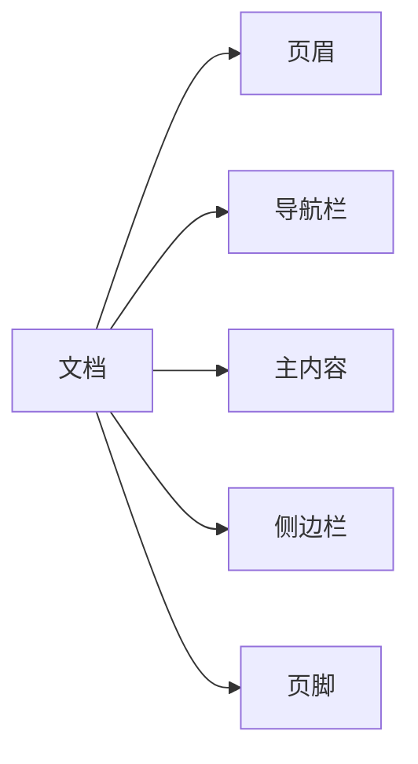

---
点击下面的链接开始今天的学习，今天需要将HTML课程进行收尾，下一天开始CSS的学习
---

[文档与网站架构](https://developer.mozilla.org/zh-CN/docs/Learn/HTML/Introduction_to_HTML/Document_and_website_structure)

# 文档与网络架构

## 1.1网页的结构组成



如图示例，一个网页的组成


## 1.2网页结构标签

为了实现语义化标记，HTML 提供了明确这些区段的专用标签，例如：

- \<head>：页眉。

- \<nav>：导航栏。
- \<main>：主内容。主内容中还可以有各种子内容区段，可用<article>、<section> 和 <div> 等元素表示。

- \<aside>：侧边栏，经常嵌套在 <main> 中。
- \<footer>：页脚。

下面的标签就是，以后练习过程中能使用的常用标签：

```html
<main> 存放每个页面独有的内容。每个页面上只能用一次 <main>，且直接位于 <body> 中。最好不要把它嵌套进其它元素。
<article> 包围的内容即一篇文章，与页面其它部分无关（比如一篇博文）。
<section> 与 <article> 类似，但 <section> 更适用于组织页面使其按功能（比如迷你地图、一组文章标题和摘要）分块。一般的最佳用法是：以 标题 作为开头；也可以把一篇 <article> 分成若干部分并分别置于不同的 <section> 中，也可以把一个区段 <section> 分成若干部分并分别置于不同的 <article> 中，取决于上下文。
<aside> 包含一些间接信息（术语条目、作者简介、相关链接，等等）。
<header> 是简介形式的内容。如果它是 <body> 的子元素，那么就是网站的全局页眉。如果它是 <article> 或<section> 的子元素，那么它是这些部分特有的页眉（此 <header> 非彼 标题）。
<nav> 包含页面主导航功能。其中不应包含二级链接等内容。
<footer> 包含了页面的页脚部分。
```

## 1.3无语义元素

有时你会发现，对于一些要组织的项目或要包装的内容，现有的语义元素均不能很好对应。有时候你可能只想将一组元素作为一个单独的实体来修饰来响应单一的用 CSS 或 JavaScript。为了应对这种情况，==HTML提供了 <div> 和 <span> 元素。应配合使用 class 属性提供一些标签，使这些元素能易于查询。==

### 1.3.1\<span>

<span> 是一个内联的（inline）无语义元素，最好只用于无法找到更好的语义元素来包含内容时，或者不想增加特定的含义时。例如：

```html
<p>国王喝得酩酊大醉，在凌晨 1 点时才回到自己的房间，踉跄地走过门口。<span class="editor-note">[编辑批注：此刻舞台灯光应变暗]</span>.</p>
```

<p>国王喝得酩酊大醉，在凌晨 1 点时才回到自己的房间，踉跄地走过门口。<span class="editor-note">[编辑批注：此刻舞台灯光应变暗]</span>.</p>

这里，“编辑批注”仅仅是对舞台剧导演提供额外指引；没有具体语义。对于视力正常的用户，CSS 应将批注内容与主内容稍微隔开一些。

### 1.3.2\<div>

\<div> 是一个块级无语义元素，应仅用于找不到更好的块级元素时，或者不想增加特定的意义时。例如，一个电子商务网站页面上有一个一直显示的购物车组件。

```html
<div class="shopping-cart">
  <h2>购物车</h2>
  <ul>
    <li>
      <p><a href=""><strong>银耳环</strong></a>：$99.95.</p>
      
    </li>
    <li>
      ...
    </li>
  </ul>
  <p>售价：$237.89</p>
</div>
```

<div class="shopping-cart">
  <h2>购物车</h2>
  <ul>
    <li>
      <p><a href=""><strong>银耳环</strong></a>：$99.95.</p>
      
    </li>
    <li>
      ...
    </li>
  </ul>
  <p>售价：$237.89</p>
</div>

这里不应使用 `<aside>`，因为它和主内容并没有必要的联系（你想在任何地方都能看到它）。甚至不能用 `<section>` ，因为它也不是页面上主内容的一部分。所以在这种情况下就应使用 `<div>`，为满足无障碍使用特征，还应为购物车的标题设置一个可读标签。

